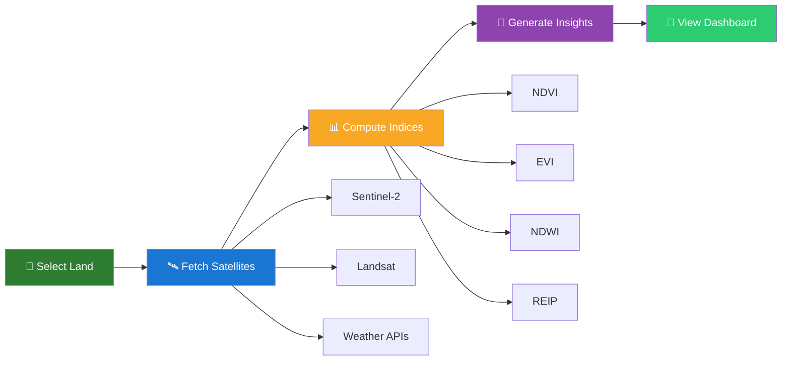

<a name="readme-top"></a>

<div align="center">
  
</div>

<br>

<div align="center">
  
  # 🌾 Krishi Drishti — कृषि दृष्टि
  
  ### *Satellite Vision for Smart Farming*
  
  **Free satellite-based crop health monitoring for Indian farmers — from space to your pocket 🛰️📱**
  
  <br>

  <!-- ====== CATEGORY: FRAMEWORK & LANGUAGES ====== -->
  **📦 Framework & Languages**
  
  [](https://flutter.dev)
  [](https://dart.dev)
  [](https://python.org)
  [](https://fastapi.tiangolo.com)
  [](https://javascript.com)
  [](https://html.spec.whatwg.org)
  [](https://www.w3.org/Style/CSS/)

  <br>

  <!-- ====== CATEGORY: INFRASTRUCTURE & CLOUD ====== -->
  **☁️ Infrastructure & Cloud**
  
  [](https://supabase.com)
  [](https://netlify.com)
  [](https://render.com)
  [](https://github.com/features/actions)
  [](https://postgresql.org)

  <br>

  <!-- ====== CATEGORY: MAPS & VISUALIZATION ====== -->
  **🗺️ Mapping & Visualization**
  
  [](https://leafletjs.com)
  [](https://openstreetmap.org)
  [](https://grafana.com)
  [](https://qiskit.org)
  [](https://tailwindcss.com)

  <br>

  <!-- ====== CATEGORY: PLATFORMS ====== -->
  **📱 Platforms**
  
  [](https://developer.android.com)
  [](https://web.dev/progressive-web-apps/)
  [](https://flutter.dev)

  <br>
  
  <!-- ====== STATUS BADGES ====== -->
  <br>
  
  [](https://github.com/virahitvin8/Krishi-Drishti/releases)
  [](https://github.com/virahitvin8/Krishi-Drishti/actions)
  [](https://github.com/virahitvin8/Krishi-Drishti/releases)
  [](LICENSE)
  [](https://github.com/virahitvin8/Krishi-Drishti/stargazers)
  [](https://github.com/virahitvin8/Krishi-Drishti/pulls)
  [](https://github.com/virahitvin8/Krishi-Drishti/issues)
  [](CONTRIBUTING.md)
  [](https://krishi-drishti-backend.onrender.com/health)
  
  <br>
  
  <!-- ====== DOWNLOAD BUTTONS ====== -->
  <a href="#-download-apk-">
    
  </a>
  <a href="https://krishidrishti.netlify.app" target="_blank">
    
  </a>
  <a href="https://krishi-drishti-backend.onrender.com/docs" target="_blank">
    
  </a>
  <a href="SETUP_GUIDE.md">
    
  </a>

  <br>
  <br>

  <p><b>Made with ❤️ for Indian Farmers • जय किसान 🌾</b></p>
  
  <sub>🌐 English • हिन्दी • తెలుగు • More languages coming soon</sub>
  
  <br>
  
  <table>
    <tr>
      <td align="center">⭐️ <b>If you find this useful, star the repo!</b></td>
      <td align="center">🐛 <b>Found a bug?</b> <a href="https://github.com/virahitvin8/Krishi-Drishti/issues/new">Report it here</a></td>
      <td align="center">💡 <b>Have an idea?</b> <a href="https://github.com/virahitvin8/Krishi-Drishti/discussions">Start a discussion</a></td>
    </tr>
  </table>
  
</div>

<br>

---

<p align="center">
  <a href="#-features">✨ Features</a> •
  <a href="#️-how-it-works">🛰️ How It Works</a> •
  <a href="#-download-apk-">📲 Download APK</a> •
  <a href="#-screenshots">📱 Screenshots</a> •
  <a href="#-system-architecture">🏗️ Architecture</a> •
  <a href="#-technology-stack">🛠️ Tech Stack</a> •
  <a href="#-quick-start">🚀 Quick Start</a> •
  <a href="#-api-endpoints">📖 API</a> •
  <a href="#%EF%B8%8F-app-workflow-diagram">📊 Workflow</a> •
  <a href="#-satellite-data-sources">📡 Satellites</a> •
  <a href="#-quantum-technology">⚡ Quantum</a> •
  <a href="#-contributing">🤝 Contributing</a> •
  <a href="#-license">📜 License</a>
</p>

---

## ✨ Features

Krishi Drishti brings the power of satellites directly to Indian farmers. Here's what you can do:

<div align="center">

| | Feature | Description | Tech |
|---|---|---|---|
| 🛰️ | **Multi-Satellite Analysis** | 18+ satellite sources — Sentinel-2, Sentinel-1 SAR, Landsat, ISRO | ESA + NASA + ISRO |
| 🌿 | **Crop Health Indices** | NDVI, EVI, NDWI, GNDVI, REIP, SAVI — all with % breakdowns | Python + FastAPI |
| 📊 | **Overall Health Score** | 0–100 score with color-coded status (Excellent → Critical) | Custom algorithm |
| 🗺️ | **Interactive Hotspot Grid** | 5×5 transparent grid — 🔴 stressed vs 🔵 healthy zones | Leaflet.js |
| 🌤️ | **Weather Integration** | Live data, 3-day forecast, evapotranspiration | NASA POWER + Open-Meteo |
| 💧 | **Irrigation Advice** | Smart recommendations — NDWI + weather + soil moisture | Multi-sensor fusion |
| 🐛 | **Pest Risk Scoring** | Risk assessment based on REIP, humidity, temperature | ML algorithm |
| 🏔️ | **Topography & Drainage** | Slope, aspect, drainage analysis | Copernicus DEM |
| 📄 | **CSV Batch Upload** | Upload multiple field coordinates for bulk analysis | FastAPI backend |
| 📱 | **PWA + Native App** | Works as installable PWA and native Android (Flutter) | Flutter + HTML |
| 🌐 | **Multi-lingual** | English, हिन्दी, తెలుగు — add your language! | Translation engine |
| 📈 | **Grafana Dashboard** | Real-time monitoring with interactive panels | Grafana JSON API |
| 💾 | **Save & Track Farms** | Save locations and track health over time | Supabase + localStorage |
| 🌾 | **Farming Advisory** | Crop calendar, sowing/harvest timing, fertilizer schedules | Expert system |
| 🏪 | **Nearby Services** | GIS map of KBTs, seed shops, fertilizer & pesticide stores | Overpass API |
| 🐛 | **Pest Management** | Organic & chemical controls for blast, rust, bollworm, mildew | Agronomy DB |
| ⚡ | **Quantum Ready** | Quantum crop classification — IBM Qiskit integration | Qiskit + AerSimulator |
| 📲 | **Auto-Update** | Checks GitHub for new releases — pop-up notification | GitHub API |

</div>

<details>
  <summary><b>🎯 Click to see what farmers are saying</b></summary>
  <br>
  
  > *"Finally, a farming app in Hindi! I can check my wheat field health without any technical knowledge."* — **Rajesh, Farmer, UP**
  
  > *"The hotspot grid shows exactly which parts of my farm need water. Game changer!"* — **Priya, Farmer, Maharashtra**
  
  > *"Free satellite data for Indian farmers? This is exactly what we needed."* — **Dr. Sharma, Agricultural University**
  
  <br>
</details>

<p align="right"><a href="#readme-top">⬆ Back to top</a></p>

---

## 🛰️ How It Works



### Step-by-Step

| Step | Action | What Happens |
|------|--------|-------------|
| **①** | **📍 Select your land** | Draw on map, enter GPS coordinates, or upload a CSV of field locations |
| **②** | **🛰️ Satellites scan your farm** | System fetches latest imagery from Sentinel-2 (10m), Sentinel-1 SAR, and Landsat 8/9 |
| **③** | **📊 AI analyzes crop health** | Advanced indices computed: NDVI, EVI, NDWI, REIP, SAVI, GNDVI |
| **④** | **🧠 Get instant results** | Dashboard shows health score, index breakdowns, weather, pest risk, recommendations |
| **⑤** | **📈 Track over time** | Save farms, monitor changes, view trends via Grafana dashboard |

<p align="right"><a href="#readme-top">⬆ Back to top</a></p>

---

## 📲 Download APK 

<div align="center">

### 📱 Krishi Drishti — Android App

[-2E7D32?style=for-the-badge&logo=android&logoColor=white)](https://github.com/virahitvin8/Krishi-Drishti/releases/latest)

**⬆️ Click the button above → Scroll down → Download the APK file**

</div>

### APK Download Options

| Version | Filename | Size | Android | Best For | Download |
|---------|----------|------|---------|----------|----------|
| **Latest** | `Krishi-Drishti-v1.1.0-debug.apk` | ~158 MB | 5.0+ | ✅ **Everyone** — fully functional | [⬇️ Download](https://github.com/virahitvin8/Krishi-Drishti/releases/latest) |
| **Release** | `Krishi-Drishti-v1.1.0-release.apk` | ~40 MB | 5.0+ | ⏳ Coming soon (code signing) | Coming soon |

> **💡 Tip:** The Debug APK works perfectly for testing and daily use. The smaller Release APK will be available after Google Play code signing.

### 📱 Installation Steps (2 Minutes)

```bash
Step 1: Download the APK from GitHub Releases (link above)
Step 2: On Android → Settings → Security → Install unknown apps
Step 3: Enable "Allow from this source" for your file manager
Step 4: Open the APK file → Tap "Install" → "Open"
Step 5: Launch Krishi Drishti → Tap "🎯 Demo" → "🔍 Analyze" 🎉
```

### 🌐 Also Available as PWA (No Install Needed)

Open **[krishidrishti.netlify.app](https://krishidrishti.netlify.app)** in Chrome on your phone → tap **"Add to Home Screen"** to install the PWA version (works offline!).

| Feature | APK (Native) | PWA (Web) |
|---------|:-----------:|:--------:|
| Install Size | 158 MB | ~1 MB cache |
| GPS/GNSS | ✅ Full access | ⚠️ Limited |
| Offline Maps | ✅ Yes | ⚠️ Limited |
| Performance | ⚡ Excellent | ✅ Good |
| Updates | Manual APK | 🔄 Instant reload |

### ❓ Which File Should You Use?

| Your Situation | Download This |
|----------------|--------------|
| Android phone user | **APK from Releases** or **Web PWA** |
| No Android phone | **Web PWA** (krishidrishti.netlify.app) |
| Developer | **Git clone + flutter run** |
| Just want to test | **Web PWA** — no install needed! |

<p align="right"><a href="#readme-top">⬆ Back to top</a></p>

---

## 📖 Complete Setup Guide

For a **complete, step-by-step guide** covering everything — directory structure explained, which APK to choose, how to install, all features explained, maps & layers, quantum integration, CI/CD, troubleshooting:

> 📄 **[SETUP_GUIDE.md](SETUP_GUIDE.md)** — *The complete Krishi Drishti setup manual*

<p align="right"><a href="#readme-top">⬆ Back to top</a></p>

---

## 📱 Screenshots

> 🎯 **Live screenshots coming soon!** Once the app UI is finalized, real screenshots will replace the placeholders below.
>
> *To see the app in action right now:*
> - 🌐 Open the **[Web App](https://krishidrishti.netlify.app)**
> - 📲 Download the **[APK](https://github.com/virahitvin8/Krishi-Drishti/releases/latest)**

<div align="center">
  <table>
    <tr>
      <td align="center" width="33%">
        <b>🌿 Dashboard</b><br>
        <sub>Health score, crop indices, weather & pest risk</sub>
        <br><br>
        
        <br><br>
        <sup><i>📸 Replace with real dashboard screenshot (280px width)</i></sup>
      </td>
      <td align="center" width="33%">
        <b>📊 Multi-Satellite Report</b><br>
        <sub>All indices, pest risk & recommendations</sub>
        <br><br>
        
        <br><br>
        <sup><i>📸 Replace with real report screenshot (280px width)</i></sup>
      </td>
      <td align="center" width="33%">
        <b>⚙️ Settings</b><br>
        <sub>Profile, language & data preferences</sub>
        <br><br>
        
        <br><br>
        <sup><i>📸 Replace with real settings screenshot (280px width)</i></sup>
      </td>
    </tr>
  </table>
  
  <br>
  
  <details>
    <summary><b>🖼️ How to add your screenshots</b></summary>
    <br>
    
    ```bash
    # 1. Take screenshots on your phone or simulator
    # 2. Save as PNG files (280px width recommended)
    # 3. Name them: dashboard.png, report.png, settings.png
    # 4. Place in: .github/screenshots/
    # 5. Update the image URLs in README.md
    # 6. Commit and push!
    ```
    
    <br>
  </details>
  
  <br>
  
  <p><i>⬆️ Replace the placeholder SVGs above with real app screenshots once ready.</i></p>
  
</div>

<p align="right"><a href="#readme-top">⬆ Back to top</a></p>

---

## 🏗️ System Architecture

```
┌─────────────────────────────────────────────────────────────────────────┐
│                           KRISHI DRISHTI ARCHITECTURE                    │
├─────────────────────────────────────────────────────────────────────────┤
│                                                                          │
│  ┌─────────────────────┐    ┌─────────────────────────────────────────┐ │
│  │    CLIENT LAYER      │    │            API LAYER                    │ │
│  │                      │    │                                         │ │
│  │  ┌─────────────────┐ │    │  ┌─────────────────────────────────┐   │ │
│  │  │  Flutter App     │ │    │  │  FastAPI Backend (Python)       │   │ │
│  │  │  (Android/iOS)   │◄├───┼──┤  • Analysis Engine              │   │ │
│  │  └─────────────────┘ │    │  │  • CDSE Integration             │   │ │
│  │                      │    │  │  • GEE Integration              │   │ │
│  │  ┌─────────────────┐ │    │  │  • ISRO Bhoonidhi              │   │ │
│  │  │  PWA Web App     │ │    │  │  • Weather Service             │   │ │
│  │  │  (Leaflet Map)   │◄├───┼──┤  • Translation Engine          │   │ │
│  │  └─────────────────┘ │    │  │  • Grafana Query API           │   │ │
│  │                      │    │  │  • User Management             │   │ │
│  │  ┌─────────────────┐ │    │  │  • CSV Batch Processing        │   │ │
│  │  │  Grafana Dash.   │ │    │  └─────────────────────────────────┘   │ │
│  │  │  (Monitoring)    │◄├───┼────────────────────────────────────┘   │ │
│  │  └─────────────────┘ │    │                                         │ │
│  └─────────────────────┘    └─────────────────────────────────────────┘ │
│                                                                          │
│  ┌─────────────────────┐    ┌─────────────────────────────────────────┐ │
│  │   SATELLITE SOURCES  │    │         STORAGE LAYER                  │ │
│  │                      │    │                                         │ │
│  │  🛰️ Sentinel-2 A/B   │    │  ┌─────────────────────────────────┐   │ │
│  │  📡 Sentinel-1 SAR   │    │  │  Supabase (PostgreSQL)          │   │ │
│  │  🌍 Landsat 8/9      │    │  │  • User profiles                │   │ │
│  │  🇮🇳 ISRO Resourcesat│    │  │  • Saved farms                  │   │ │
│  │  🌤️ NASA POWER       │    │  │  • Analysis history             │   │ │
│  │  🌧️ Open-Meteo       │    │  └─────────────────────────────────┘   │ │
│  │  🗺️ Copernicus DEM   │    │                                         │ │
│  └─────────────────────┘    │  ┌─────────────────────────────────┐   │ │
│                              │  │  Local Storage (PWA/Flutter)   │   │ │
│                              │  │  • Farm cache                  │   │ │
│                              │  │  • User preferences            │   │ │
│                              │  └─────────────────────────────────┘   │ │
│                              └─────────────────────────────────────────┘ │
│                                                                          │
│  ┌──────────────────────────────────────────────────────────────────┐   │
│  │  DEPLOYMENT                                                      │   │
│  │  ┌──────────────┐  ┌──────────────┐  ┌────────────────────────┐│   │
│  │  │  Netlify     │  │  Render      │  │  GitHub Actions        ││   │
│  │  │  (Frontend)  │  │  (Backend)   │  │  (CI/CD + APK Build)   ││   │
│  │  └──────────────┘  └──────────────┘  └────────────────────────┘│   │
│  └──────────────────────────────────────────────────────────────────┘   │
│                                                                          │
└─────────────────────────────────────────────────────────────────────────┘
```

<p align="right"><a href="#readme-top">⬆ Back to top</a></p>

---

## 🛠️ Technology Stack

<details open>
  <summary><b>📱 Frontend (Mobile App — Flutter)</b></summary>
  <br>
  
  | Technology | Version | Purpose |
  |------------|---------|---------|
  | [Flutter](https://flutter.dev) | 3.4+ | Cross-platform mobile framework |
  | [Dart](https://dart.dev) | 3.4+ | Programming language |
  | [flutter_map](https://pub.dev/packages/flutter_map) | Latest | Interactive maps + OSM tiles |
  | [Provider](https://pub.dev/packages/provider) | Latest | State management |
  | [geolocator](https://pub.dev/packages/geolocator) | Latest | GPS/GNSS location services |
  | [http](https://pub.dev/packages/http) | Latest | API communication |
  | [shared_preferences](https://pub.dev/packages/shared_preferences) | Latest | Local storage |
  | [shimmer](https://pub.dev/packages/shimmer) | Latest | Loading animations |
  | [cached_network_image](https://pub.dev/packages/cached_network_image) | Latest | Image caching |
  
  <br>
</details>

<details open>
  <summary><b>🌐 Frontend (Web PWA)</b></summary>
  <br>
  
  | Technology | Purpose |
  |------------|---------|
  | HTML5 + CSS3 | Structure & styling |
  | [Tailwind CSS](https://tailwindcss.com) | Utility-first styling via CDN |
  | [Leaflet.js](https://leafletjs.com) | Interactive satellite map |
  | [OpenStreetMap](https://openstreetmap.org) | Base map tiles |
  | PWA Service Worker | Offline caching & installability |
  
  <br>
</details>

<details open>
  <summary><b>🖥️ Backend (API)</b></summary>
  <br>
  
  | Technology | Version | Purpose |
  |------------|---------|---------|
  | [Python](https://python.org) | 3.11+ | Backend language |
  | [FastAPI](https://fastapi.tiangolo.com) | Latest | High-performance REST API |
  | [Uvicorn](https://uvicorn.org) | Latest | ASGI server |
  | [httpx](https://www.python-httpx.org) | Latest | Async HTTP client |
  | [Google Earth Engine](https://developers.google.com/earth-engine) | Latest | Satellite data processing |
  | [Supabase Python](https://supabase.com/docs/reference/python/) | Latest | Database + auth client |
  | [Qiskit](https://qiskit.org) | Latest | Quantum computing (optional) |
  
  <br>
</details>

<details open>
  <summary><b>🚀 DevOps & CI/CD</b></summary>
  <br>
  
  | Tool | Purpose |
  |------|---------|
  | [GitHub Actions](https://github.com/features/actions) | CI/CD — auto-build APK on push & tags |
  | [Netlify](https://netlify.com) | PWA hosting with automatic deploys |
  | [Render](https://render.com) | Backend hosting with health checks |
  | [Harness CI](https://harness.io) | Alternative CI pipeline (free tier) |
  | [Grafana](https://grafana.com) | Real-time monitoring dashboard |
  
  <br>
</details>

<p align="right"><a href="#readme-top">⬆ Back to top</a></p>

---

## 🚀 Quick Start

### Prerequisites
```
✓ Flutter SDK 3.4+     (https://docs.flutter.dev/get-started/install)
✓ Python 3.11+         (https://python.org)
✓ Android Studio/VSCode (for Flutter development)
```

### Clone & Run in 30 Seconds

```bash
# 1. Clone the repository
git clone https://github.com/virahitvin8/Krishi-Drishti.git
cd Krishi-Drishti/KrishiDrishti_Final_v4

# 2. Run the Flutter Mobile App
cd flutter_app
flutter pub get
flutter run              # Runs on connected device/emulator

# 3. Or build APK for Android
flutter build apk --debug   # Krishi Drishti APK (~158 MB)

# 4. Run the Backend API (optional)
cd ../backend
pip install -r requirements.txt
uvicorn main:app --reload   # API at http://localhost:8000

# 5. Open API docs
# http://localhost:8000/docs
```

### Deploy in One Click

| Platform | Service | Setup |
|----------|---------|-------|
| 🌐 **Frontend** | [Netlify](https://netlify.com) | Import repo → Publish `frontend/` → Deploy |
| 🖥️ **Backend** | [Render](https://render.com) | New Web Service → `backend/` → `uvicorn main:app` |
| 🤖 **CI/CD** | [GitHub Actions](https://github.com/features/actions) | Pushes auto-trigger → Builds APK → Creates Release |

<p align="right"><a href="#readme-top">⬆ Back to top</a></p>

---

## 📖 API Endpoints

Explore the full [Swagger UI docs](https://krishi-drishti-backend.onrender.com/docs) or run locally at `http://localhost:8000/docs`.

| Endpoint | Method | Description |
|----------|--------|-------------|
| `/` | GET | API info & all available endpoints |
| `/health` | GET | Health check for monitoring |
| `/api/v1/analyze` | POST | Analyze a field by polygon coordinates |
| `/api/v1/dashboard` | GET | Dashboard data for a farm |
| `/api/v1/upload-csv` | POST | Batch upload CSV of field coordinates |
| `/api/v1/schedule` | GET | Satellite data refresh schedule |
| `/api/v1/report/{field_id}` | GET | Detailed report for a specific field |
| `/api/v1/satellites` | GET | Available satellite data sources |
| `/api/v1/translate/{language}` | GET | Translation endpoints |
| `/api/v1/grafana/dashboard-json` | GET | Grafana dashboard JSON config |
| `/api/v1/grafana/query/*` | GET | Grafana query proxy endpoints |
| `/api/v1/user/register` | POST | Register a new user |
| `/api/v1/user/{username}` | GET | Get user profile |
| `/api/v1/farming/calendar` | GET | Crop sowing/harvest calendar |
| `/api/v1/farming/pest-management` | GET | Pest & disease management |
| `/api/v1/farming/nearby-services` | GET | Nearby KBTs & agri shops |
| `/api/v1/farming/farming-tips` | GET | Current season tips |
| `/api/v1/quantum/status` | GET | Quantum service status |
| `/api/v1/quantum/analyze` | POST | Quantum crop classification |
| `/api/v1/quantum/irrigation` | POST | QAOA irrigation optimization |

<p align="right"><a href="#readme-top">⬆ Back to top</a></p>

---

## 📊 App Workflow Diagram

<p align="center">
  
  <br>
  <sub><i>Animated SVG showing: ① Satellite data sources → ② Backend processing → ③ User interfaces (Web PWA + Flutter App) → ④ Deployment & CI/CD</i></sub>
</p>

<p align="right"><a href="#readme-top">⬆ Back to top</a></p>

---

## 🌍 Deployment

### Live URLs

| Service | URL | Status |
|---------|-----|--------|
| 🌐 **Web App (PWA)** | [krishidrishti.netlify.app](https://krishidrishti.netlify.app) | ✅ Live |
| 🖥️ **Backend API** | [krishi-drishti-backend.onrender.com](https://krishi-drishti-backend.onrender.com) | ✅ Live |
| 📄 **API Docs** | [krishi-drishti-backend.onrender.com/docs](https://krishi-drishti-backend.onrender.com/docs) | ✅ Swagger UI |
| 📈 **Grafana** | Configure via `/api/v1/grafana/dashboard-json` | ⚙️ Configurable |

### CI/CD Pipeline

The project uses **GitHub Actions** for automated builds:

- **On push/PR** → `flutter analyze` → Build debug APK
- **On tag `v*`** → Build release APK → Create GitHub Release with APK attached
- **Manual trigger** → Workflow dispatch with build type selection (debug/release)

<p align="right"><a href="#readme-top">⬆ Back to top</a></p>

---

## 📡 Satellite Data Sources

Krishi Drishti integrates data from **18+ satellite and earth observation sources**:

| # | Source | Agency | Type | Resolution | Revisit | Key Use |
|---|--------|--------|------|-----------|---------|---------|
| 1 | 🛰️ **Sentinel-2 A/B** | ESA | Optical | **10 m** | 5-day | NDVI, EVI, NDWI, REIP, SAVI |
| 2 | 📡 **Sentinel-1 SAR** | ESA | Radar | **10 m** | 6-day | Soil moisture, flood detection |
| 3 | 🌍 **Landsat 8/9** | NASA/USGS | Optical | **30 m** | 8-day | Long-term veg trends (since 1982) |
| 4 | 🔥 **Sentinel-3 SLSTR** | ESA | Thermal | 1 km | Daily | Land surface temperature |
| 5 | 💧 **Sentinel-3 OLCI** | ESA | Optical | 300 m | Daily | Chlorophyll, water quality |
| 6 | 🌱 **SMAP** | NASA | Radar | 10 km | 3-day | Surface soil moisture |
| 7 | 🌊 **GRACE-FO** | NASA | Gravity | — | Monthly | Groundwater anomaly trends |
| 8 | 📊 **MODIS NDVI** | NASA | Optical | 250 m | 16-day | Long-term vegetation trends |
| 9 | 🌧️ **CHIRPS** | UCSB | Rainfall | 5.5 km | Daily | Precipitation |
| 10 | 🗺️ **Copernicus DEM** | ESA | Elevation | **30 m** | Static | Slope, aspect, drainage |
| 11 | 🧪 **OpenLandMap** | ISRIC | Soil | 250 m | Static | Texture, pH, organic C |
| 12 | 🌡️ **ERA5-Land** | ECMWF | Reanalysis | 11 km | Hourly | Climate reanalysis |
| 13 | ☀️ **NASA POWER** | NASA | Meteorology | 0.5° | Daily | Temp, humidity, solar, ET |
| 14 | 🌤️ **Open-Meteo** | Free | Forecast | 5 km | 3-day | Free weather forecast |
| 15 | 🇮🇳 **Cartosat-3** | ISRO | Optical | **0.25 m** | 5-day | Sub-meter crop stress |
| 16 | 🇮🇳 **Resourcesat-2 LISS-IV** | ISRO | Optical | **5.8 m** | 5-day | Field-scale vegetation |
| 17 | 🇮🇳 **HySIS** | ISRO | Hyperspectral | **30 m** (55 bands) | 30-day | Crop chemistry (N, P, K) |
| 18 | 🇮🇳 **RISAT-1A** | ISRO | SAR | 3–25 m | 12-day | All-weather radar |

<p align="right"><a href="#readme-top">⬆ Back to top</a></p>

---

## ⚡ Quantum Technology

Krishi Drishti is **quantum-ready** — the architecture supports integrating quantum computing for advanced agricultural analysis. A working quantum crop classifier is included in the backend.

### Free Quantum APIs

| Provider | Free Tier | Python Library | Use Case |
|----------|-----------|----------------|----------|
| **IBM Quantum** | 10 min/month | `qiskit` | Crop classification via Quantum ML |
| **AWS Braket** | Free simulator credits | `amazon-braket-sdk` | Irrigation optimization (QAOA) |
| **Azure Quantum** | Free simulation | `qsharp` | Fertilizer chemistry simulation |
| **Google Cirq** | Free simulator | `cirq` | Research & algorithm prototyping |

### Quick Start

```bash
# Install Qiskit (free, no API key needed for simulator)
pip install qiskit qiskit-aer

# Test the quantum endpoint
curl -X POST https://krishi-drishti-backend.onrender.com/api/v1/quantum/analyze \
  -H "Content-Type: application/json" \
  -d '{"ndvi":0.48,"evi":0.51,"ndwi":0.31,"reip":0.32,"savi":0.35}'
```

> 🔬 **Note:** Start with **free simulators** (unlimited usage) before using real quantum hardware. See [SETUP_GUIDE.md](SETUP_GUIDE.md#-quantum-technology-integration) for detailed setup.

<p align="right"><a href="#readme-top">⬆ Back to top</a></p>

---

## 🤝 Contributing

We welcome contributions from **developers, agriculturists, translators, and designers**! Check out [CONTRIBUTING.md](CONTRIBUTING.md) for detailed guidelines.

### How You Can Help

| Area | Skills Needed | Impact |
|------|---------------|--------|
| 🌐 **Translations** | Hindi, Tamil, Telugu, Marathi | 🎯 High — helps thousands of farmers |
| 🐛 **Bug Fixes** | Python, JavaScript, Flutter | 🎯 High — improves reliability |
| 🛰️ **Satellite Integration** | Remote sensing, Python | 🚀 Huge — adds new data sources |
| 📱 **Mobile UX** | Flutter, UI design | 🎯 High — improves farmer experience |
| 🧪 **Pest Models** | ML, agronomy | 🌿 Critical — early detection saves crops |
| 📖 **Documentation** | Technical writing | 🎯 High — helps all users |

### Quick Contribution Flow

```bash
git checkout -b feature/your-awesome-feature
# Make your changes
git commit -m "feat: add your awesome feature"
git push origin feature/your-awesome-feature
# Open a Pull Request 🚀
```

<p align="right"><a href="#readme-top">⬆ Back to top</a></p>

---

## 👥 Contributors

<a href="https://github.com/virahitvin8">
  
</a>
<a href="https://github.com/virahitvin8/Krishi-Drishti/graphs/contributors">
  
</a>

<br>
<sub>👋 **Be the next contributor!** Open a PR and add your name to this list.</sub>

<br><br>

<div align="center">
  
  [](https://star-history.com/#virahitvin8/Krishi-Drishti&Date)
  
</div>

<p align="right"><a href="#readme-top">⬆ Back to top</a></p>

---

## 🐳 Harness CI Pipeline

Krishi Drishti supports **Harness CI** (free tier) as an alternative CI/CD pipeline. The pipeline file is at `.harness/build-apk-pipeline.yaml`.

### What's Fixed (v1.1.0)

| Issue | Fix |
|-------|-----|
| ❌ Missing `set -e` error handling | ✅ Added |
| ❌ No timeout limit for builds | ✅ Added timeout |
| ❌ GRADLE_OPTS YAML escaping | ✅ Fixed |
| ❌ No Android license acceptance | ✅ Added |
| ❌ No APK verification | ✅ Added |

See [SETUP_GUIDE.md](SETUP_GUIDE.md#-harness-ci-pipeline-setup) for import instructions.

<p align="right"><a href="#readme-top">⬆ Back to top</a></p>

---

## 📜 License

This project is licensed under the **MIT License** — see the [LICENSE](LICENSE) file for details.

```
Copyright © 2026 Neelam Akshit Vinay

Permission is hereby granted, free of charge, to any person obtaining a copy
of this software and associated documentation files...
```

---

## 🙏 Acknowledgments

| | Organization | For |
|---|-------------|-----|
| 🛰️ | **[ESA Copernicus](https://copernicus.eu)** | Free & open Sentinel satellite data |
| 🌍 | **[NASA Earth Science](https://earthdata.nasa.gov)** | Earth observation data & POWER API |
| 🇮🇳 | **[ISRO](https://www.isro.gov.in)** | Indian satellite missions (Resourcesat, Cartosat, HySIS) |
| 🗺️ | **[OpenStreetMap](https://openstreetmap.org)** | Free map tiles & geographic data |
| 📱 | **[Flutter Team](https://flutter.dev)** | Amazing cross-platform framework |
| ⚡ | **[FastAPI Team](https://fastapi.tiangolo.com)** | High-performance Python API framework |
| 🍃 | **[Leaflet.js](https://leafletjs.com)** | Lightweight interactive maps |
| 🌤️ | **[Open-Meteo](https://open-meteo.com)** | Free weather API |
| 🗄️ | **[Supabase](https://supabase.com)** | Open-source Firebase alternative |
| 🏆 | **[Shields.io](https://shields.io)** | Badge generation for project READMEs |
| 🌾 | **All Indian farmers** | Your feedback makes this project better every day 🙏 |

---

## 📬 Contact

<div align="center">

| 📧 Email | 🐙 GitHub | 🌐 Web App |
|:--------:|:---------:|:---------:|
| **akshitvinay4636@gmail.com** | [@virahitvin8](https://github.com/virahitvin8) | [krishidrishti.netlify.app](https://krishidrishti.netlify.app) |

</div>

---

<div align="center">
  
  <br>
  
  ### **🇮🇳 जय किसान • जय विज्ञान 🌾🛰️**
  
  **Empowering Indian farmers with the power of satellites**
  
  <br>
  
  <table>
    <tr>
      <td align="center">
        <a href="https://github.com/virahitvin8/Krishi-Drishti/stargazers">
          
        </a>
      </td>
      <td align="center">
        <a href="https://github.com/virahitvin8">
          
        </a>
      </td>
      <td align="center">
        <a href="https://github.com/virahitvin8/Krishi-Drishti/forks">
          
        </a>
      </td>
    </tr>
  </table>
  
  <br>

  [](https://github.com/virahitvin8)
  
  <br>
  
  <sub>Made with ❤️ and 🛰️ for Indian farmers • © 2026 Krishi Drishti</sub>
  <br>
  <sub>Free & Open Source • MIT License</sub>
  
</div>
